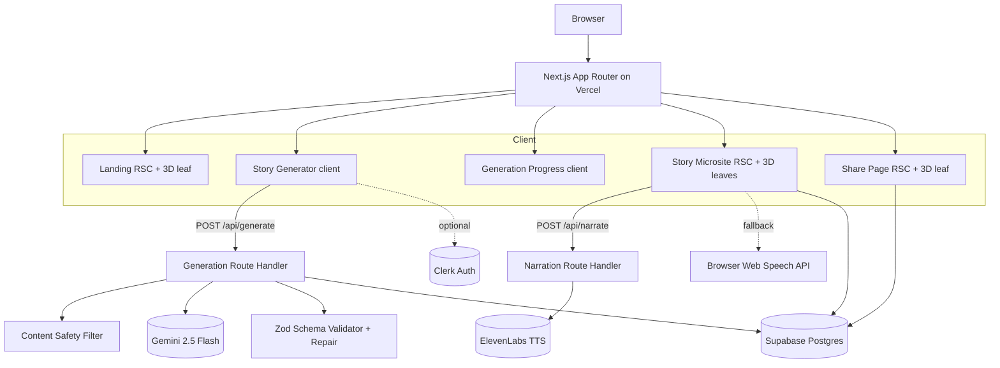
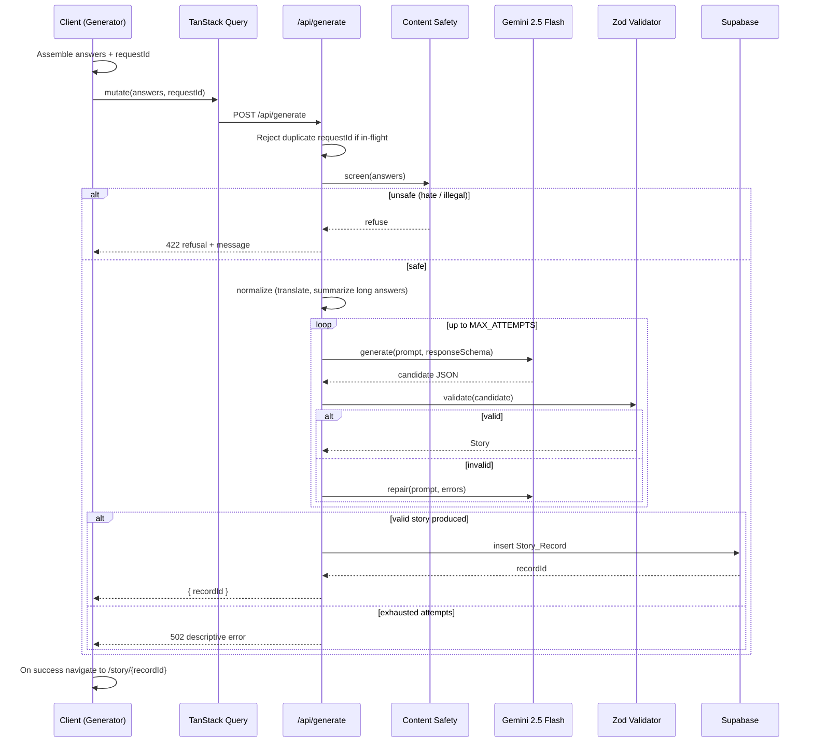

# Design Document

## Overview

Origin is a Next.js (App Router) application that turns seven personal answers into a cinematic, shareable "origin story" microsite. The core value is presentation: instead of returning plain text, Origin renders AI output as an immersive experience (3D hero, interactive timeline, holographic character card, movie poster, voice narration, public share page).

This design targets two hackathon judging levers directly:

- **Technical execution & presentation (45% combined weight):** a stable demo-critical flow (Landing → Generator → Progress → Story → Share) with a guaranteed 2D fallback so the demo never fails on unknown hardware or conference WiFi.
- **Meaningful prize-technology use:** Google Gemini 2.5 Flash powers the generation pipeline with schema-constrained structured output and self-repair; ElevenLabs powers premium narration with a Web Speech API fallback.

The system is guest-first: a visitor can generate and share a story with zero authentication. Stories persist as anonymous records so share links resolve for anyone. An optional Clerk account lets users associate, list, and delete their stories.

### Design Principles

1. **Server Components first.** The Landing, Story microsite, and Share pages render as React Server Components that read persisted data server-side. `"use client"` boundaries are pushed down to the smallest interactive leaves (3D canvases, forms, narration controls).
2. **Degrade gracefully, always.** Every 3D surface has a polished 2D fallback. WebGL absence, reduced-motion preference, and low device capability each map to a defined non-3D or reduced path. The system renders exactly one rendering mode per surface, never both.
3. **The AI boundary is untrusted.** Gemini output is never consumed directly. It is parsed, validated against a Zod schema, and repaired before it can become a `Story_Record`. Persistence only happens on the validated success path.
4. **Deterministic core, stochastic edge.** The logic that decides _what_ to render, _which_ provider to narrate with, _whether_ to accept input, and _how_ to repair output is written as pure, testable functions independent of React, network, and the Gemini SDK.

### Key Technical Decisions

| Decision             | Choice                                                                                       | Rationale                                                                                                                                                                                                                             |
| -------------------- | -------------------------------------------------------------------------------------------- | ------------------------------------------------------------------------------------------------------------------------------------------------------------------------------------------------------------------------------------- |
| Structured AI output | Gemini `responseMimeType: "application/json"` + `responseSchema`, then Zod re-validation     | Schema-constrained decoding drastically reduces malformed JSON; Zod is the trust boundary because model schema adherence is not guaranteed ([Gemini structured output docs](https://ai.google.dev/gemini-api/docs/structured-output)) |
| Narration            | ElevenLabs streaming TTS via a Next.js Route Handler, Web Speech API fallback in the browser | ElevenLabs keys stay server-side; streaming gives low time-to-first-audio; Web Speech guarantees zero-cost fallback ([ElevenLabs TTS integration](https://elevenlabs.io/blog/text-to-speech-api-integration))                         |
| Persistence          | Supabase (Postgres) with a service-role client behind API routes                             | Anonymous records need server-side writes without exposing keys; RLS protects account-scoped reads/writes                                                                                                                             |
| Auth                 | Clerk, optional                                                                              | Guest-first flow requires generation without a session; Clerk augments rather than gates                                                                                                                                              |
| Server state         | TanStack Query on the client for generation mutation + polling; RSC fetch for page loads     | Mutation lifecycle (pending/error/retry) maps cleanly to the progress view; static reads stay on the server                                                                                                                           |
| Poster               | Client-rendered SVG/Canvas from a Gemini design spec                                         | Zero image-generation cost, instant, unlimited, and PNG-exportable via canvas serialization                                                                                                                                           |

---

## Architecture

### System Context



### Rendering & Degradation Strategy

Origin makes rendering decisions from three capability signals resolved on the client after hydration:

- `webglAvailable` — probed by attempting to acquire a WebGL context.
- `reducedMotion` — from `prefers-reduced-motion` (via Motion's `useReducedMotion`).
- `deviceTier` — a heuristic (`high` | `low`) from `navigator.hardwareConcurrency`, `deviceMemory`, and a first-frame timing sample.

A single pure function resolves these into a render mode per surface, guaranteeing mutual exclusivity (Requirement 1.7):

```
resolveRenderMode({ webglAvailable, reducedMotion, surfaceSupports3D }) -> "3d-full" | "3d-reduced" | "2d-fallback"
```

- No WebGL → `2d-fallback` (Requirements 1.4, 7.5, 15.3).
- WebGL + reduced motion → `2d-fallback` or `3d-reduced` with animation suppressed (Requirements 1.5, 14.3).
- WebGL + `deviceTier=low` → `3d-reduced` (fewer particles, no shadows, no post-processing) (Requirements 15.2, 15.5).
- Otherwise → `3d-full`.

All 3D scenes load through `next/dynamic` with `ssr: false` and a defined loading state, and are wrapped in Suspense so primary content paints first (Requirements 15.1, 15.4, 15.6). A shared `baseAnimationBudget` caps concurrent animations regardless of preference (Requirement 14.7).

### Generation Data Flow



### Route Map

| Route                | Type                         | Responsibility                                           |
| -------------------- | ---------------------------- | -------------------------------------------------------- |
| `/`                  | RSC                          | Landing page, hero CTA "Begin Journey"                   |
| `/create`            | Client                       | Story Generator multi-step flow                          |
| `/create/generating` | Client                       | Generation progress view (drives the mutation)           |
| `/story/[id]`        | RSC                          | Interactive story microsite (owner/preview view)         |
| `/s/[id]`            | RSC                          | Public share page (no auth)                              |
| `/stories`           | RSC (Clerk-gated)            | Authenticated user's saved stories                       |
| `/api/generate`      | Route Handler (Node runtime) | Orchestrates safety → Gemini → validate → persist        |
| `/api/narrate`       | Route Handler (Node runtime) | Proxies ElevenLabs streaming TTS                         |
| `/api/stories/[id]`  | Route Handler                | DELETE for account-owned records                         |
| `not-found.tsx`      | RSC                          | On-brand not-found for missing records (Requirement 7.6) |

`/api/generate` and `/api/narrate` use the Node runtime (not Edge) because they use the Gemini and ElevenLabs SDKs and the Supabase service-role client.

---

## Components and Interfaces

The system is organized into a **pure core** (framework-agnostic logic, fully unit- and property-testable), **services** (I/O adapters), and **UI** (RSC + client leaves).

### Pure Core (`src/lib/core/`)

These modules contain no React, network, or SDK imports. They are the primary target of property-based tests.

#### `render-mode.ts`

```ts
type Capability = {
	webglAvailable: boolean;
	reducedMotion: boolean;
	deviceTier: "high" | "low";
};
type RenderMode = "3d-full" | "3d-reduced" | "2d-fallback";

function resolveRenderMode(
	cap: Capability,
	surfaceSupports3D: boolean,
): RenderMode;
```

Guarantees exactly one mode; never returns a 3D mode when `webglAvailable` is false or `surfaceSupports3D` is false.

#### `input-classifier.ts`

```ts
type InputVerdict =
	| { kind: "ok" }
	| { kind: "needs-followup"; reason: "single-word" }
	| { kind: "needs-text"; reason: "emoji-only" };

function classifyAnswer(raw: string): InputVerdict;
function isEffectivelyEmpty(raw: string): boolean; // all-whitespace
function detectContradictions(answers: Answers): ContradictionFlag[];
```

Handles single-word (Requirement 9.1), emoji-only (9.2), empty/whitespace (2.5), and contradiction detection (9.4).

#### `answer-normalizer.ts`

```ts
function needsSummarization(text: string, max: number): boolean;
function prepareForGeneration(
	answers: Answers,
	cfg: NormalizeConfig,
): NormalizedAnswers;
```

Marks over-length answers for summarization (Requirement 9.3) and flags non-English answers for translation (Requirement 13.6).

#### `story-schema.ts`

The single Zod source of truth (`StorySchema`) plus derived TypeScript types and the Gemini `responseSchema` projection.

```ts
function validateStory(
	candidate: unknown,
): { ok: true; story: Story } | { ok: false; issues: ZodIssue[] };
function issuesToRepairHints(issues: ZodIssue[]): string;
```

#### `generation-policy.ts`

```ts
function nextAction(
	state: AttemptState,
): "call" | "repair" | "succeed" | "fail";
function shouldRetryRateLimit(attempt: number, max: number): boolean;
function backoffMs(attempt: number, base: number, cap: number): number;
```

Encodes the attempt/repair/backoff/exhaustion state machine (Requirements 4.4, 4.5, 4.7, 4.9, 4.10) as a pure reducer.

#### `poster-spec.ts`

```ts
function withPosterDefaults(spec: Partial<PosterSpec>): PosterSpec;
```

Fills any missing field with defined defaults so the poster always renders (Requirement 8.4).

#### `narration-selection.ts`

```ts
type Provider = "elevenlabs" | "webspeech" | "none";
function selectProvider(input: {
	elevenAvailable: boolean;
	webSpeechAvailable: boolean;
	userForcedWebSpeech: boolean;
}): Provider;
```

Encodes provider precedence and the manual Web Speech override (Requirements 10.1, 10.2, 10.6, 10.7).

#### `content-safety.ts`

```ts
type SafetyDecision =
	| { action: "allow" }
	| { action: "refuse"; category: "hate" | "illegal"; message: string }
	| { action: "sanitize"; category: "offensive" | "self-harm" | "copyright" };

function screenInput(answers: Answers): SafetyDecision;
```

Pre-generation screening (Requirements 13.1, 13.2); sanitize categories flow into prompt constraints rather than blocking.

#### `request-dedupe.ts`

```ts
function registerRequest(
	store: RequestStore,
	id: string,
): { accepted: boolean; store: RequestStore };
function resolveRequest(store: RequestStore, id: string): RequestStore;
```

In-flight request-id tracking (Requirements 6.2, 6.3).

#### `draft-codec.ts`

```ts
function encodeDraft(draft: Draft): string;
function decodeDraft(raw: string): { ok: true; draft: Draft } | { ok: false };
```

Serialize/deserialize the generator draft; `decode` never throws, returning `ok: false` on corruption (Requirement 3.7).

### Services (`src/lib/services/`)

Thin I/O adapters that compose the pure core with external systems.

- **`gemini-service.ts`** — wraps `@google/genai`. `generateStory(prompt, schema)` and `repairStory(prompt, hints)`. Distinguishes rate-limit errors so `generation-policy` can drive backoff.
- **`generation-orchestrator.ts`** — server-only. Runs safety → normalize → the `generation-policy` loop over `gemini-service` and `validateStory` → persist. Returns a discriminated result (`success | refusal | error`).
- **`narration-service.ts` (server)** — proxies ElevenLabs streaming; returns an audio stream. Reports availability for `selectProvider`.
- **`story-repository.ts`** — Supabase adapter: `insertStoryRecord`, `getStoryRecord`, `listStoriesForUser`, `deleteStoryRecord`. Anonymous inserts set `owner_id = null`.
- **`share-service.ts`** — builds the canonical share URL and QR payload; `insertStoryRecord` failure does not fail generation (Requirement 11.8).

### UI Components (`src/components/`)

Server Components by default; client leaves marked `"use client"`.

| Component                       | Kind                            | Notes                                                                                                       |
| ------------------------------- | ------------------------------- | ----------------------------------------------------------------------------------------------------------- |
| `sections/HeroLanding`          | RSC + `HeroScene3D` client leaf | CTA is a semantic `<Link>` button, keyboard-focusable (Requirements 1.1, 1.3, 1.6)                          |
| `generator/StepWizard`          | Client                          | Orchestrates 7 steps, progress indicator, back/next, RHF + Zod per step (Requirement 2.\*)                  |
| `generator/steps/*`             | Client                          | One component per Input_Step; Passion step includes custom entry (2.6, 2.7)                                 |
| `generator/useDraftPersistence` | Hook                            | Debounced write to `Draft_Store`; restore on mount (Requirement 3.\*)                                       |
| `progress/GenerationProgress`   | Client                          | Drives the TanStack Query mutation; energy-sphere 3D or reduced indicator; error + retry (Requirement 5.\*) |
| `story/StorySections`           | RSC                             | Renders Hero/Story/Timeline/Character/Poster/Quotes/Future/Share from the record (Requirement 7.1)          |
| `story/CharacterCard3D`         | Client leaf                     | Holographic tilt card; 2D fallback + error placeholder (7.4, 7.5, 7.8)                                      |
| `story/PosterRenderer`          | Client leaf                     | SVG/Canvas render + PNG export (Requirement 8.\*)                                                           |
| `story/NarrationControls`       | Client leaf                     | Provider selection, voice choice, play/pause (Requirement 10.\*)                                            |
| `share/SharePanel`              | Client leaf                     | QR, copy story, social targets, PNG download (Requirement 11.\*)                                            |
| `shared/FallbackScene`          | Client                          | Polished 2D hero used across surfaces (Requirements 1.4, 15.3)                                              |
| `shared/CapabilityProvider`     | Client context                  | Resolves capability signals once, exposes `RenderMode` per surface                                          |

### API Contracts

**`POST /api/generate`**

```ts
// Request
{ requestId: string; answers: Answers }
// Responses
200 { recordId: string; shareUrl: string | null }        // shareUrl null => Requirement 11.8
422 { error: "refused"; category: "hate" | "illegal"; message: string }
502 { error: "generation_failed"; message: string }      // Requirements 4.7, 4.10
409 { error: "duplicate"; requestId: string }             // Requirement 6.3
```

**`POST /api/narrate`**

```ts
// Request
{
	recordId: string;
	voice: "male" | "female";
	text: string;
}
// Response: audio/mpeg stream, or 503 when ElevenLabs unavailable (client falls back)
```

**`DELETE /api/stories/[id]`** — Clerk-authenticated; removes the record from the user's saved stories (Requirement 12.5).

---

## Data Models

### Answers (client input)

```ts
interface Answers {
	name: string;
	profession: string;
	country?: string;
	passion: string; // predefined or custom text
	originMoment: string;
	lowestPoint: string;
	turningPoint: string;
	dream: string;
	oneSentence: string;
}
```

Per-step Zod schemas back React Hook Form; required text fields reject all-whitespace values.

### Story (Gemini output, Zod-validated)

`StorySchema` is the trust boundary. The Gemini `responseSchema` mirrors it; Zod re-validates after decoding.

```ts
const PosterSpecSchema = z.object({
	theme: z.string(),
	background: z.string(),
	title: z.string(),
	subtitle: z.string(),
	primaryColor: z.string(),
	secondaryColor: z.string(),
	accent: z.string(),
	layout: z.enum(["Centered", "LeftAligned", "Split"]),
	decorations: z.array(z.string()),
});

const TimelineStageSchema = z.object({
	key: z.enum(["beginning", "failure", "breakthrough", "today", "future"]),
	title: z.string(),
	body: z.string(),
});

const CharacterProfileSchema = z.object({
	mission: z.string(),
	strengths: z.array(z.string()).min(1),
	weaknesses: z.array(z.string()).min(1),
	motivation: z.string(),
	coreValues: z.array(z.string()).min(1),
});

const SocialAssetsSchema = z.object({
	linkedin: z.string(),
	twitterThread: z.array(z.string()).min(1),
	instagram: z.string(),
	portfolioBio: z.string(),
	resumeSummary: z.string(),
});

const StorySchema = z.object({
	heroTitle: z.string().min(1),
	tagline: z.string().min(1),
	originStory: z.string().refine((s) => {
		const words = s.trim().split(/\s+/).length;
		return words >= 1000 && words <= 1500;
	}, "originStory must be 1000-1500 words"),
	timeline: z.array(TimelineStageSchema).length(5),
	character: CharacterProfileSchema,
	quote: z.string().min(1),
	trailerScript: z.string().min(1),
	social: SocialAssetsSchema,
	poster: PosterSpecSchema,
	inferredContent: z.array(z.string()).default([]), // labels non-user-provided content (Requirement 4.8)
});

type Story = z.infer<typeof StorySchema>;
```

The word-count refinement enforces Requirement 4.2; a failure produces a Zod issue that `issuesToRepairHints` turns into a targeted repair instruction.

### Story_Record (Supabase `stories`)

```sql
create table stories (
  id           uuid primary key default gen_random_uuid(),
  owner_id     text,                       -- Clerk user id; null for anonymous
  slug         text unique not null,       -- short public share id
  answers      jsonb not null,             -- source of truth for regeneration/audit
  story        jsonb not null,             -- validated Story
  created_at   timestamptz not null default now()
);

create index stories_owner_id_idx on stories (owner_id);
```

- Public reads by `slug` are allowed via RLS for the share/microsite pages (Requirements 11.2, 12.2).
- Writes go through the service-role client in route handlers; account-scoped list/delete filter on `owner_id` (Requirements 12.3–12.5).

### Draft (local storage)

```ts
interface Draft {
	answers: Partial<Answers>;
	activeStep: number; // 0..6
	updatedAt: number;
}
```

Stored under a stable key. Writes are debounced on change (Requirement 3.1); reads decode defensively (Requirement 3.7); a successful generation clears the key (Requirement 3.5), and clear failures are swallowed (Requirement 3.6).

### AttemptState (generation policy)

```ts
interface AttemptState {
	attempt: number; // 0-based
	maxAttempts: number;
	lastOutcome: "none" | "invalid" | "rate-limited" | "valid";
	hasValidStory: boolean;
}
```

Consumed by `nextAction`/`backoffMs` to drive the orchestrator loop deterministically.

---

## Correctness Properties

_A property is a characteristic or behavior that should hold true across all valid executions of a system — essentially, a formal statement about what the system should do. Properties serve as the bridge between human-readable specifications and machine-verifiable correctness guarantees._

These properties target the **pure core** modules, which contain the input-varying logic worth exercising across hundreds of generated inputs. UI presence checks, navigation, persistence side effects, and infrastructure wiring are covered by example and integration tests in the Testing Strategy instead.

### Property 1: Render mode is single-valued and never 3D without capability

_For any_ capability input (any combination of `webglAvailable`, `reducedMotion`, `deviceTier`) and any surface flag, `resolveRenderMode` returns exactly one value from `{"3d-full", "3d-reduced", "2d-fallback"}`, and that value is never a 3D mode when `webglAvailable` is false or the surface does not support 3D.

**Validates: Requirements 1.2, 1.4, 1.7, 7.4, 7.5, 11.7, 15.3**

### Property 2: Capability degrades to reduced or fallback

_For any_ capability input where `reducedMotion` is true, `resolveRenderMode` never returns `"3d-full"`; and _for any_ input where `webglAvailable` is true and `deviceTier` is `"low"`, it returns `"3d-reduced"`.

**Validates: Requirements 1.5, 14.3, 15.2**

### Property 3: Step navigation is consistent and bounded

_For any_ answer set and any current step index, advancing from a non-final step increases the index by exactly one, advancing from the final step leaves the index unchanged, and going back from any step after the first decreases the index by one while keeping the active step type consistent with the index and retaining all previously entered values.

**Validates: Requirements 2.2, 2.3, 2.9, 2.10**

### Property 4: Empty required input blocks advancing

_For any_ string composed entirely of whitespace (including the empty string), `isEffectivelyEmpty` returns true and the advance control for that required field is disabled.

**Validates: Requirements 2.5**

### Property 5: Custom passion is accepted verbatim

_For any_ non-empty custom passion text, selecting it results in the selected `Passion` equalling that exact text.

**Validates: Requirements 2.7**

### Property 6: Generation enabled iff all answers valid

_For any_ `Answers` object, the generation control is enabled if and only if every required field is present and not effectively empty.

**Validates: Requirements 2.8**

### Property 7: Draft codec round-trips and decodes total

_For any_ `Draft`, `decodeDraft(encodeDraft(draft))` yields `{ ok: true, draft }` equal to the original; and _for any_ arbitrary string, `decodeDraft` never throws and returns `{ ok: false }` for input it cannot parse.

**Validates: Requirements 3.2, 3.7**

### Property 8: Story schema validation enforces structure and word count

_For any_ candidate object, `validateStory` accepts it if and only if it contains all required fields (hero title, tagline, timeline of five stages, character profile, quote, trailer script, social assets, poster spec) and its `originStory` word count lies within 1000–1500 inclusive; any candidate missing a field or outside the word range is rejected with issues.

**Validates: Requirements 4.2, 4.3**

### Property 9: Generation policy transitions are correct and terminal

_For any_ `AttemptState`: if a valid story exists, `nextAction` is `"succeed"`; else if attempts remain and the last outcome was invalid, `nextAction` is `"repair"`; else if the maximum number of attempts has been reached without a valid story, `nextAction` is `"fail"` regardless of any partial results.

**Validates: Requirements 4.4, 4.7, 4.9, 4.10**

### Property 10: Rate-limit backoff is monotonic, capped, and bounded by max attempts

_For any_ attempt number below the maximum, `shouldRetryRateLimit` returns true, and `backoffMs` is non-decreasing as the attempt number grows and never exceeds the configured cap.

**Validates: Requirements 4.5**

### Property 11: Duplicate in-flight requests are ignored

_For any_ request identifier, registering it while it is in flight accepts the first registration and rejects every subsequent registration of the same identifier until it is resolved.

**Validates: Requirements 6.3**

### Property 12: Microsite render completeness is gated by a valid record

_For any_ valid `Story_Record`, the microsite renders all eight sections (Hero, Story, Timeline, Character, Poster, Quotes, Future, Share), the Story section contains the origin story text, and the Timeline section renders exactly as many stages as the record's timeline; _for any_ input without a valid record, no story text or timeline stages are rendered.

**Validates: Requirements 7.1, 7.2, 7.3, 7.7**

### Property 13: Poster reflects its specification

_For any_ complete `PosterSpec`, the rendered poster output includes the title, subtitle, primary/secondary/accent colors, layout, and every decoration named in the specification.

**Validates: Requirements 8.2**

### Property 14: Poster defaulting fills every missing field

_For any_ partial `PosterSpec`, `withPosterDefaults` returns a specification in which every field is defined, using the provided value where present and the defined default otherwise.

**Validates: Requirements 8.4**

### Property 15: Single-word answers require a follow-up

_For any_ non-empty answer consisting of a single token (no internal whitespace), `classifyAnswer` returns `needs-followup`.

**Validates: Requirements 9.1**

### Property 16: Emoji-only answers require a text description

_For any_ answer consisting solely of emoji characters, `classifyAnswer` returns `needs-text`.

**Validates: Requirements 9.2**

### Property 17: Over-length answers are summarized and bounded

_For any_ text whose length exceeds the configured maximum, `needsSummarization` returns true and the answer produced by `prepareForGeneration` has length no greater than the configured maximum.

**Validates: Requirements 9.3**

### Property 18: Narration provider precedence and override

_For any_ combination of availability flags, `selectProvider` returns `"webspeech"` whenever the user forces Web Speech and Web Speech is available; otherwise it returns `"elevenlabs"` when ElevenLabs is available, then `"webspeech"` when only Web Speech is available, and `"none"` only when neither is available.

**Validates: Requirements 10.1, 10.2, 10.6, 10.7**

### Property 19: QR code round-trips the share URL

_For any_ share URL, decoding the generated QR payload yields the original URL.

**Validates: Requirements 11.3**

### Property 20: Social share intents embed the encoded share URL

_For any_ supported social target and any share URL, the constructed share intent URL contains the correctly percent-encoded share URL.

**Validates: Requirements 11.6**

### Property 21: Unsafe input is classified into the correct action

_For any_ answers containing a flagged hate/extremist token, `screenInput` returns `refuse` with category `hate`; _for any_ answers describing a flagged illegal achievement, it returns `refuse` with category `illegal`; and _for any_ answers containing flagged offensive tokens (without hate/illegal content), it returns `sanitize` with category `offensive`.

**Validates: Requirements 13.1, 13.2, 13.4**

### Property 22: Text contrast meets accessibility thresholds

_For any_ defined foreground/background token pair used for text, the computed contrast ratio is at least 4.5:1 for body text and at least 3:1 for large text.

**Validates: Requirements 14.4**

### Property 23: Concurrent animations respect the baseline budget

_For any_ motion preference (reduced or not), the number of concurrent non-essential animations resolved for a page never exceeds `baseAnimationBudget`.

**Validates: Requirements 14.7**

---

## Error Handling

Errors are handled at the boundary closest to their source, and every failure has a defined user-visible outcome that keeps the demo flow alive.

### AI Pipeline (`/api/generate`)

- **Invalid model output:** `validateStory` fails → the orchestrator issues one repair request per remaining attempt, feeding `issuesToRepairHints(issues)` back to Gemini. Persistence never occurs for unvalidated output (Requirements 4.4, 4.9).
- **Rate limiting:** rate-limit errors are detected in `gemini-service` and drive `backoffMs` retries via `generation-policy`; the request is not counted as a hard failure until attempts are exhausted (Requirement 4.5).
- **Exhausted attempts:** after `MAX_ATTEMPTS` without a valid story, the handler returns `502 { error: "generation_failed", message }`. The progress view surfaces the message and a retry control (Requirements 4.7, 4.10, 5.3).
- **Content refusal:** `screenInput` returns `refuse` → `422` with an explanatory message; no Gemini call is made (Requirements 13.1, 13.2).

### Persistence & Sharing

- **Story insert failure:** returns `502`; nothing is persisted, generation is reported as failed.
- **Share URL creation failure (post-persist):** generation still succeeds; the client receives `shareUrl: null` and the UI shows "sharing is unavailable" without blocking the story (Requirement 11.8).
- **Missing record on load:** RSC read returns null → `not-found.tsx` renders an on-brand message with a "Return to Landing" control (Requirement 7.6).

### Rendering & Degradation

- **No WebGL / reduced motion / low tier:** handled proactively by `resolveRenderMode`; the 2D `FallbackScene` or reduced 3D renders instead of failing (Requirements 1.4, 1.5, 15.2, 15.3).
- **Character card fallback failure:** an error boundary around the card renders an error placeholder in the Character section (Requirement 7.8).
- **Poster render failure:** the `PosterRenderer` catches render/serialization errors, shows an error message, and suppresses the download action (Requirement 8.5).
- **3D asset independence:** 3D scenes load in isolated Suspense/error boundaries so a primary-content failure does not block them and vice versa (Requirement 15.6).

### Draft Persistence

- **Corrupted draft:** `decodeDraft` returns `{ ok: false }` (never throws) → the generator notifies the user and starts a fresh draft (Requirement 3.7).
- **Clear-after-success failure:** swallowed; the generated story is presented regardless (Requirement 3.6).
- **Network interruption:** answers remain in `Draft_Store`; the flow resumes on reconnect (Requirements 3.3, 3.4).

### Narration

- **ElevenLabs unavailable/quota (`503`):** the client falls back to the Web Speech provider per `selectProvider` (Requirement 10.2).
- **No provider available:** narration controls are hidden and the trailer script text is shown instead (Requirement 10.6).

### Duplicate Submission

- The generation control disables on submit and stays disabled while duplicates are ignored; the server rejects duplicate in-flight request ids with `409` (Requirements 6.1, 6.3, 6.4).

### Error Boundaries

Route-segment `error.tsx` boundaries wrap `/create`, `/story/[id]`, and `/s/[id]`; component-level boundaries wrap each 3D leaf and the poster renderer. No raw error text is shown to users — all boundaries render on-brand fallbacks with a recovery action.

---

## Testing Strategy

Origin uses a dual approach: **property-based tests** for the pure core (universal correctness across generated inputs) and **example/integration tests** for UI presence, navigation, persistence, and external-service wiring. Property-based testing applies here because the core decision logic (render-mode resolution, schema validation, generation policy, input classification, provider selection, poster defaulting, safety screening) consists of pure functions with meaningful input variation — exactly where 100+ generated iterations find edge cases that a few examples miss. UI rendering, 3D scenes, Supabase/Clerk/ElevenLabs integration, and the Gemini call itself are covered by example and integration tests, not PBT.

### Tooling

- **Test runner:** Vitest (fast, TS-native, works with Next.js).
- **Property-based testing:** `fast-check` (the standard PBT library for TypeScript; > 100k downloads). Property tests must not be hand-rolled.
- **Component testing:** React Testing Library for RSC-compatible leaves and client components.
- **Accessibility:** `@axe-core/react`/`jest-axe`-style assertions for names, roles, and contrast spot-checks.
- **Type safety gate:** `pnpm tsc --noEmit` must pass with zero errors.

### Property Test Requirements

- Each of the 23 correctness properties is implemented as a **single** `fast-check` property test.
- Each property test runs a **minimum of 100 iterations** (`fc.assert(fc.property(...), { numRuns: 100 })`).
- Each test is tagged with a comment referencing the design property in the format:
  `// Feature: origin, Property {number}: {property_text}`
- Custom `fast-check` arbitraries are defined for `Capability`, `Answers`, `Draft`, `Story`, `PosterSpec`, and `AttemptState` so generators exercise realistic and adversarial inputs (empty strings, whitespace, emoji, over-length text, boundary word counts at 999/1000/1500/1501, missing poster fields, all availability-flag combinations).

### Example & Integration Tests

- **Landing/Generator/Progress/Share UI:** presence of CTA, tagline, step list, progress indicator, retry control, QR, copy, social, PNG download (Requirements 1.1, 1.3, 1.6, 2.1, 2.4, 2.6, 5.1–5.3, 10.3–10.5, 11.1, 11.4, 11.5).
- **Generation orchestration:** mocked Gemini + Supabase to assert the happy path calls generate with the schema, persists, and returns a record id, and that refusal/exhaustion return the correct status codes (Requirements 4.1, 4.6).
- **Edge cases:** corrupted draft handling, clear-after-success failure, nav-failure fallback, poster render failure, character fallback failure, share-url failure, contradiction detection, non-English translation flag, 3D asset independence (Requirements 3.6, 5.5, 7.8, 8.5, 9.4, 11.8, 13.6, 15.6).
- **Account flow:** anonymous vs authenticated insert, list, and delete against a test Supabase instance (Requirements 12.1–12.5).
- **Accessibility & responsiveness:** keyboard traversal, accessible names, reduced-motion behavior, breakpoint layout, orientation state preservation (Requirements 14.1, 14.2, 14.5, 14.6).

### Performance Verification

- Lighthouse checks on the demo flow targeting Performance/Accessibility/Best-Practices > 90 and Core Web Vitals (LCP < 2.5s, CLS < 0.1), consistent with the hackathon delivery checklist.
- Verify 3D scenes load via `next/dynamic` with defined loading states and do not block first paint (Requirements 15.1, 15.4).
