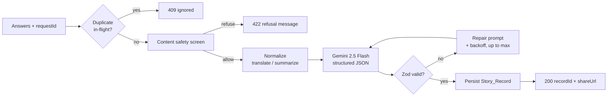

# Origin

**Turn a few personal answers into a cinematic, interactive origin story you can share like the opening scene of a movie.**

Origin is an AI-powered web app that transforms seven short answers about your passion into a premium, shareable microsite — a hero story, an interactive timeline, a character profile, a movie poster, voice narration, and a public share page. Instead of returning a block of AI text, Origin renders the output as an immersive experience.

Built for the **DEV Weekend Challenge: Passion Edition**, targeting the **Google AI** (Gemini 2.5 Flash) and **ElevenLabs** (voice narration) prize categories.

---

## Table of Contents

- [Features](#features)
- [How It Works](#how-it-works)
- [Tech Stack](#tech-stack)
- [Getting Started](#getting-started)
- [Environment Variables](#environment-variables)
- [Running Without Keys](#running-without-keys)
- [Scripts](#scripts)
- [Routes](#routes)
- [Project Structure](#project-structure)
- [Testing](#testing)
- [Accessibility & Graceful Degradation](#accessibility--graceful-degradation)
- [License](#license)

---

## Features

- **Cinematic landing page** — a 3D hero scene (Three.js / React Three Fiber) with a polished 2D fallback, and a keyboard-accessible "Begin Journey" call to action.
- **Conversational 7-step generator** — guided steps for your name, passion, origin moment, lowest point, turning point, dream, and a one-sentence self-description, with a progress indicator, back/next navigation, and per-step validation.
  - Predefined passions plus free-form custom entry.
  - Contextual follow-up prompts for single-word or emoji-only answers.
  - Contradiction detection that flags conflicting answers and links you straight to the step to fix them.
  - **Automatic draft saving** to local storage with restore-on-return and graceful recovery from corrupted drafts.
- **AI generation pipeline** — Google Gemini 2.5 Flash produces schema-constrained JSON, which is re-validated with Zod, self-repaired on failure, and retried with exponential backoff on rate limits. Content-safety screening runs before generation.
- **Animated generation progress** — an engaging (or reduced-motion) progress experience with error-and-retry handling and a fallback link if navigation fails.
- **Interactive story microsite** with eight sections:
  - Hero, full origin story, and a five-stage timeline.
  - A **holographic tilt character card** (with 2D fallback and error placeholder).
  - A **movie poster** rendered from an AI design spec via SVG, exportable as a PNG.
  - Quotes, a 60-second trailer script, forward-looking "future" content, and a share section.
- **Voice narration** — ElevenLabs streaming text-to-speech with male/female voices and play/pause, an automatic Browser Web Speech fallback, a manual override, and the trailer script shown when no provider is available.
- **Public share page** — no sign-in required: a QR code, copy-story-to-clipboard, social share targets (X, LinkedIn, Facebook, WhatsApp), poster PNG download, and a celebratory 3D hero.
- **Guest-first** — generate and share with zero sign-in.
- **Runs with zero credentials** — see [Running Without Keys](#running-without-keys).

---

## How It Works

The demo-critical flow is **Landing → Generator → Progress → Microsite → Share**. Behind the generator, the server orchestrates safety, AI generation, validation, and persistence:



The logic that decides _what_ to render, _which_ narration provider to use, _whether_ input is valid, and _how_ to repair AI output lives in a framework-agnostic **pure core** (`src/lib/core`), kept independent of React, the network, and any SDK so it can be unit- and property-tested in isolation.

---

## Tech Stack

| Area               | Technology                                                 |
| ------------------ | ---------------------------------------------------------- |
| Framework          | Next.js 16 (App Router), React 19, TypeScript (strict)     |
| Styling            | Tailwind CSS v4, shadcn/ui-style components, `next-themes` |
| Animation & 3D     | Motion (`motion/react`), Three.js, React Three Fiber, Drei |
| AI                 | Google Gemini 2.5 Flash (`@google/genai`)                  |
| Voice              | ElevenLabs streaming TTS, Browser Web Speech API fallback  |
| Forms & validation | React Hook Form + Zod                                      |
| State              | Zustand (client), TanStack Query (server state)            |
| Testing            | Vitest + fast-check + Testing Library                      |
| Package manager    | pnpm                                                       |

---

## Getting Started

### Prerequisites

- **Node.js 20+**
- **pnpm** (`npm install -g pnpm`)

### Installation

```bash
pnpm install
```

### Configure environment

Copy the provided `.env` and fill in any values you have. **Every variable is optional for local development** — without keys, the app still runs (see [Running Without Keys](#running-without-keys)).

```bash
# .env already exists with placeholders — open it and add your keys
```

### Run the dev server

```bash
pnpm dev
```

Open [http://localhost:3000](http://localhost:3000).

> Environment variables are read at startup — restart the dev server after editing `.env`.

---

## Environment Variables

All variables are optional; each unlocks a real integration when set.

| Variable                                                                         | Purpose                         | Without it                                |
| -------------------------------------------------------------------------------- | ------------------------------- | ----------------------------------------- |
| `NEXT_PUBLIC_APP_URL`                                                            | Base URL for public share links | Defaults to `http://localhost:3000`       |
| `GEMINI_API_KEY` _or_ `GOOGLE_API_KEY`                                           | Real AI story generation        | Uses a locally generated mock story       |
| `ELEVENLABS_API_KEY` + `ELEVENLABS_VOICE_ID_MALE` + `ELEVENLABS_VOICE_ID_FEMALE` | Premium voice narration         | Falls back to Web Speech / trailer script |
| `ELEVENLABS_MODEL_ID`                                                            | Narration model (has a default) | Uses `eleven_multilingual_v2`             |

---

## Running Without Keys

Origin is designed so the demo never fails on missing credentials:

- **No Gemini key?** The generator produces a complete, schema-valid mock story built from your answers.
- Generated stories persist to an **in-memory store** for the session, so the microsite and share links resolve while the server is running.

This means you can clone, `pnpm install`, `pnpm dev`, and walk the entire flow end to end without any API keys. Add a Gemini key to switch on real AI generation, and ElevenLabs keys to enable premium narration.

---

## Scripts

| Command           | Description                      |
| ----------------- | -------------------------------- |
| `pnpm dev`        | Start the development server     |
| `pnpm build`      | Production build                 |
| `pnpm start`      | Serve the production build       |
| `pnpm lint`       | Run ESLint                       |
| `pnpm typecheck`  | Type-check with `tsc --noEmit`   |
| `pnpm test`       | Run the test suite once (Vitest) |
| `pnpm test:watch` | Run tests in watch mode          |

---

## Routes

| Route                | Type          | Responsibility                                 |
| -------------------- | ------------- | ---------------------------------------------- |
| `/`                  | Page          | Cinematic landing with the "Begin Journey" CTA |
| `/create`            | Page          | The seven-step story generator                 |
| `/create/generating` | Page          | Generation progress experience                 |
| `/story/[id]`        | Page          | Interactive story microsite                    |
| `/s/[slug]`          | Page          | Public share page (no auth)                    |
| `/api/generate`      | Route handler | Safety → Gemini → validate → persist           |
| `/api/narrate`       | Route handler | ElevenLabs streaming TTS proxy                 |

---

## Project Structure

```
src/
├── app/                  # App Router pages and API route handlers
├── components/
│   ├── generator/        # Step wizard, steps, draft persistence
│   ├── progress/         # Generation progress
│   ├── providers/        # Capability + app providers
│   ├── sections/         # Landing hero
│   ├── share/            # Share panel
│   ├── shared/           # Fallback scene, dynamic 3D loaders
│   ├── story/            # Microsite sections, character card, poster, narration
│   └── ui/               # Button, Input, Textarea, Label
├── config/               # Constants and passion options
├── lib/
│   ├── core/             # Framework-agnostic pure logic (unit/property tested)
│   └── services/         # I/O adapters: Gemini, narration, share, story store
└── types/                # Shared domain and API types
```

---

## Testing

The project uses **Vitest** with **fast-check** for property-based tests and **Testing Library** for components.

```bash
pnpm test
```

The pure core in `src/lib/core` is intentionally free of React, network, and SDK dependencies so its logic (render-mode resolution, input classification, story-schema validation, generation policy, and more) can be exercised deterministically.

---

## Accessibility & Graceful Degradation

- **Keyboard accessible** interactive controls with visible focus states and semantic HTML.
- **Reduced motion** is respected across the app; animations are minimized when `prefers-reduced-motion` is set.
- **Every 3D surface has a polished 2D fallback.** A single capability check (WebGL availability, reduced-motion preference, device tier) resolves each surface to exactly one render mode — `3d-full`, `3d-reduced`, or `2d-fallback` — never both.
- 3D scenes load through deferred dynamic imports so primary content paints first, and are wrapped in error boundaries so a 3D failure can never break the page.

---

## License

Created as a submission for the DEV Weekend Challenge: Passion Edition. No open-source license is currently applied — please contact the author before reuse.
